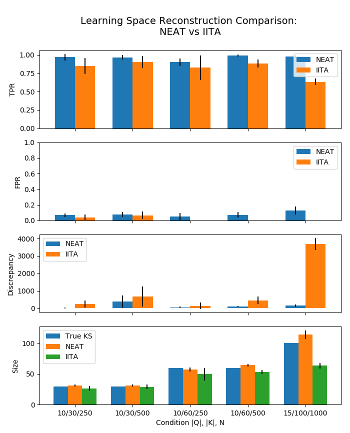

# Learning Space Reconstruction Simulation

True knowledge structures are simulated using BLIM. NEAT and IITA are compared
on learning space reconstruction using simulated datasets as input.

There are 5 simulation conditions where number of items, number of knowledge
states and sample size are changed:

|   | Items |Q| | Size |K| | Sample size |N| |
|:-:|:---------:|:--------:|:---------------:|
| 1 |     10    |    30    |       250       |
| 2 |     10    |    30    |       500       |
| 3 |     10    |    60    |       250       |
| 4 |     10    |    60    |       500       |
| 5 |     15    |    100   |       1000      |

`beta` and `eta` parameters used in BLIM are sampled uniformly from range
`[1e-8, 5e-2)`.  State probabilities are sampled uniformly from range `[0.4,
  0.6)` and then are normalized to sum up to 1.

For each condition, 10 datasets are generated, NEAT and IITA are fitted, and their performance
is evaluated on following metrics:

1. _TPR_ - true positive rate
2. _FPR_ - false positive rate
3. Discrepancy _D_ defined as dissimilarity between generated learning space and
   input sample
4. Size of generated learning space

## Getting Started

Clone `kst` repo under `simulation/` directory with `git clone
https://github.com/milansegedinac/kst.git`

Run simulation with `python -m run` inside `simulation/` directory. Results will be
outputted as JSON files for each simulation iteration (10 total.)

## Results

Below figure displays NEAT and IITA performance on described metrics. NEAT outperforms
IITA on all metrics except FPR in some conditions.

  

